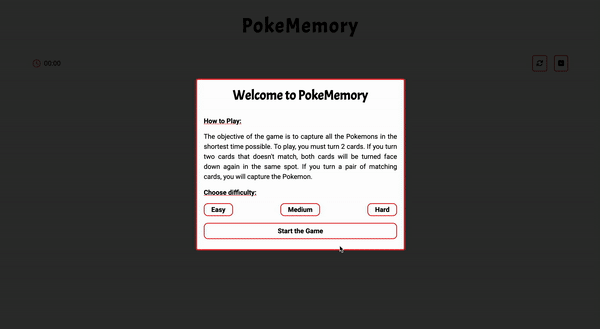

# pokemon_memory_game

<div align="center">
  <a href="https://poke-memory.netlify.app/" target="_blank">
    
  </a>
</div>

# Movie Search

> Note: Developed just to measure my progress with Vue 2.

## Technologies Used

- VUE.JS

## Links

Click [Here](https://poke-memory.netlify.app/) to access the application.

---

<p align="center">Developed by <strong>Leandro Koshoji Araujo</strong></p>

<p align="center">
   📫 leandrokoshoji@gmail.com
</p>

## Project setup

```
npm install
```

### Compiles and hot-reloads for development

```
npm run serve
```

### Compiles and minifies for production

```
npm run build
```

### Lints and fixes files

```
npm run lint
```

### Customize configuration

See [Configuration Reference](https://cli.vuejs.org/config/).
